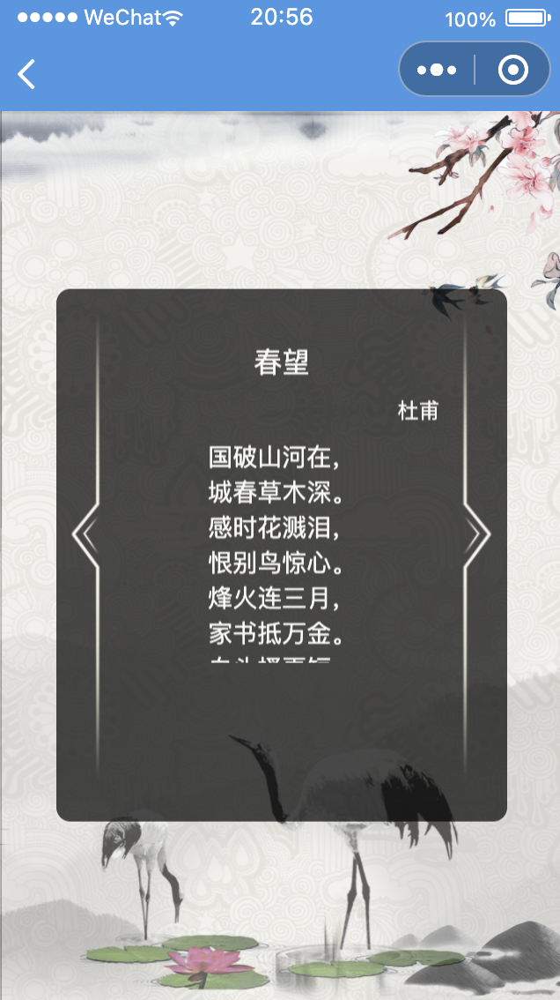
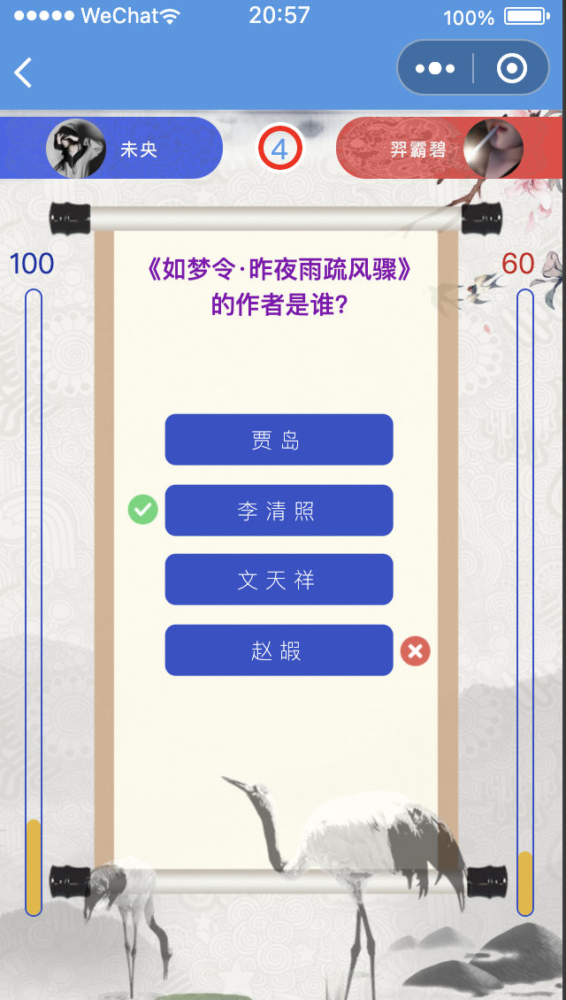

# poetry
古诗词问答类小程序,支持匹配对战

## 项目简介
> 古诗词问答类小程序，前端由uniapp构建,使用vue2编写，支持跨小程序平台编译，目前已完美适配微信小程序。后端由基于springboot，融合spring全家桶，以及redis，websocket等技术，数据库采用mongodb。
> 基于websocket实现用户间匹配对战，在超出匹配时间阈值后会自动安排虚拟用户进行对战。
## 项目截图
<div>






</div>

## 演示视频

https://user-images.githubusercontent.com/42128890/154847182-9e8e6c46-d639-42fd-89c6-2bf226fa7c2e.mp4


### 前端
[项目地址](https://github.com/prodigy99/poetry-client)
> 简介:
> 使用uniapp构建,使用vue2语法,使用websocket与ajax进行前后端交互

**Quick Start**
* 下载微信开发者工具后，将源码使用Hbuilder导入，
* config文件夹中的index.js中的baseUrl换为本机的ip地址
* 在HBuilder中选择运行到微信开发者工具即可
### 后端
[项目地址](https://github.com/prodigy99/poetry-server)

> 简介:
> 基于springboot,数据库为mongodb,使用了redis,websocket等

**Quick Start**
* 使用idea导入
* 需要在idea中安装lombok插件配合lombok，否则会编译报错
* 恢复数据库数据
``` bash
mongorestore -d poetry ./resource/data/poetry --gzip
```
* 按需修改application.yml中的配置
